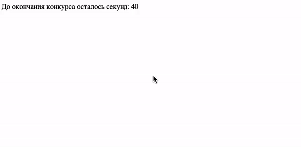
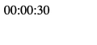

# Таймер обратного отсчёта

Домашнее задание к занятию 1.1 «Возможности JavaScript в браузере».

## Описание 

Для участия в розыгрышах товаров в социальных сетях, требуется разработать таймер
обратного отсчёта. По окончании отсчёта должно всплыть уведомление: «Вы победили в конкурсе».

### Исходные данные

Основная HTML-разметка

### Процесс реализации

1. Прочитайте данные о текущем количестве секунд таймера и запишите их в переменную. 
Это будет стартовое значение таймера
2. Каждую секунду уменьшайте значение таймера на 1
3. По окончании отсчёта выведите сообщение «Вы победили в конкурсе!», используя функцию alert();

### Повышенный уровень сложности #1 (не обязательно)

Реализуйте таймер, отсчитывающий оставшееся время в формате hh:mm:ss
(например, 04:25:19), где *hh* - двухзначное число часов, *mm* - минут, 
*ss* - секунд.

